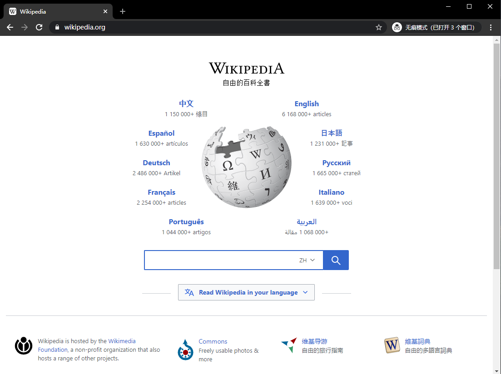
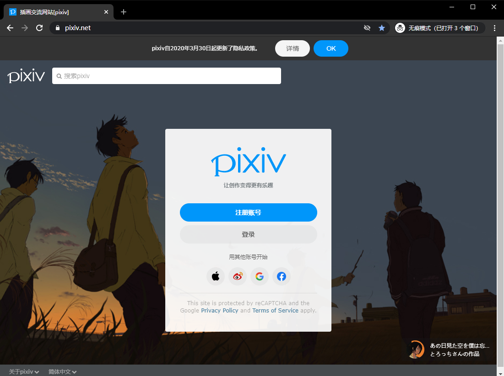
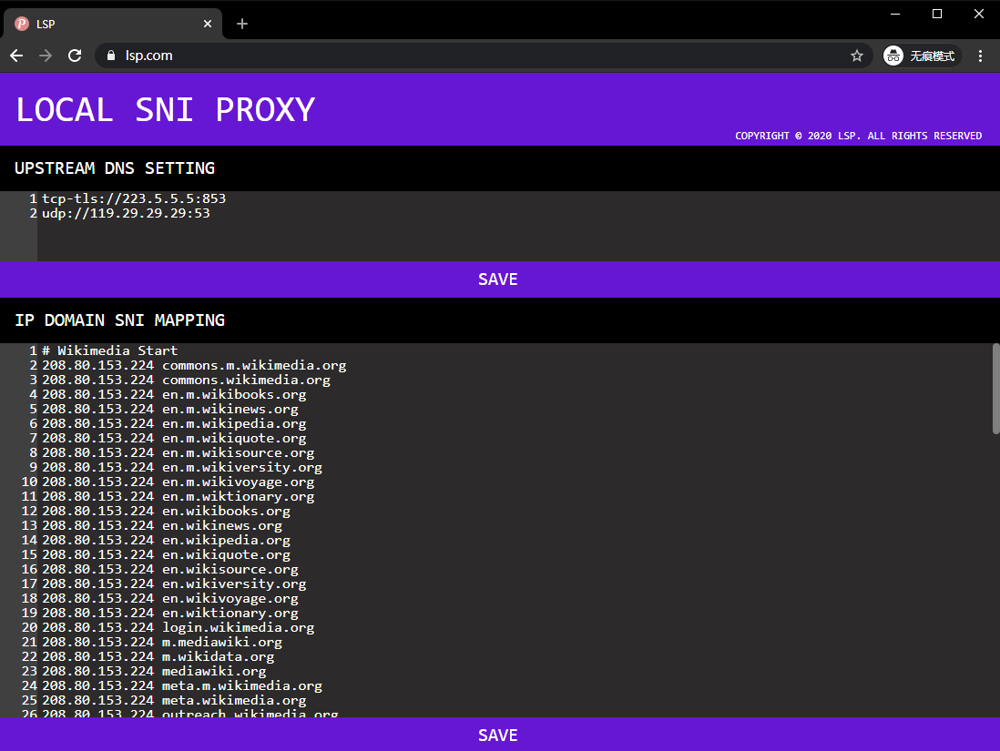

# LSP / Local SNI Proxy


## Introduction

This is a local DNS and HTTPS server, using `man-in-the-middle` approach to bypass SNI based filtering.

The server can only work on the same computer you use for internet surfing, occupying `53`, `443`, `3080` port for handling dns exchanges, SNI proxying and serving web configuration UI.





## Features

- Web Configuration UI
- Multiple Upstream DNS Servers Setting
- `IP Address - Domain - Server Name` Map Setting

## Installation

### Windows

- Download [windows.7z](//github.com/vcheckzen/LSP/raw/main/dist/lsp-windows.7z)
- Decompress it into your software folder
- Open that folder, execute `install.bat` in it with administrator privilege

### Others

- Waiting for pull requests

## Configuration

After installation, open `https://lsp.com` in one of the modern browsers, noting that must use `https`.



### Upstream DNS Setting

Input dns servers your preferred for parsing those domains not been SNI blocked.

The format of single server is `[protocol://ip:port]`, and `protocol` can only be chosen from `udp`,`tcp` and `tcp-tls`.

Different servers should be in different lines. Servers will not be used when those in the front work fine.

### IP Domain SNI Mapping

You can supply `hosts-like` config in this area to bypass both dns pollution and SNI filtering.

Peculiarly, give `server name` after `ip domain` to nominate the domain going through SNI firewall.

For example, the record below enable firewall to see a connection to `208.80.153.224` with server name `www.kernel.org`.

When not supplied, program will use `www.apple.com`.

```batch
208.80.153.224 www.wikipedia.org www.kernel.org
```

After filling the form, click `SAVE` to make it take effect. The page will stop submitting when your config has errors.

## Reference

- [bypass-GFW-SNI](https://github.com/bypass-GFW-SNI/main)